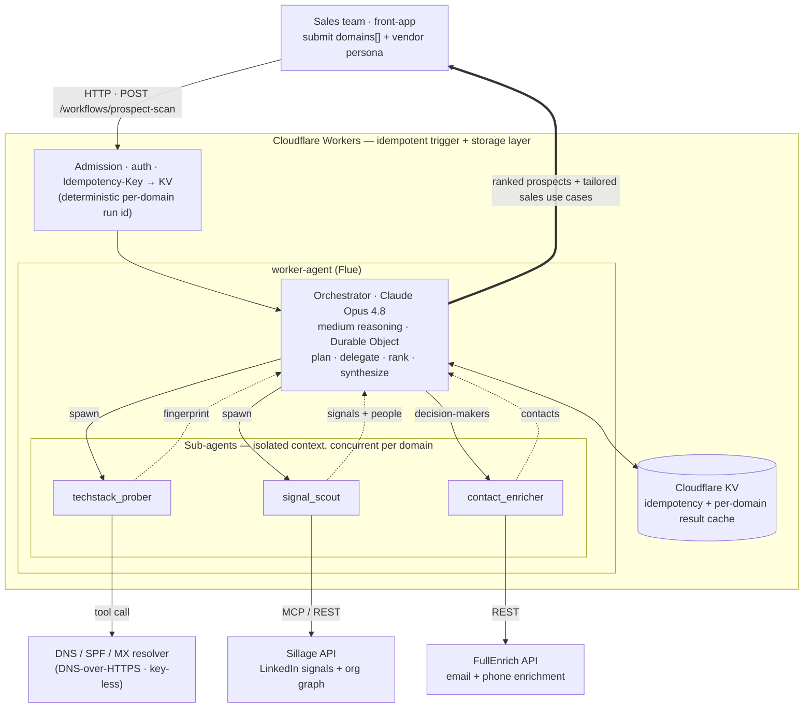
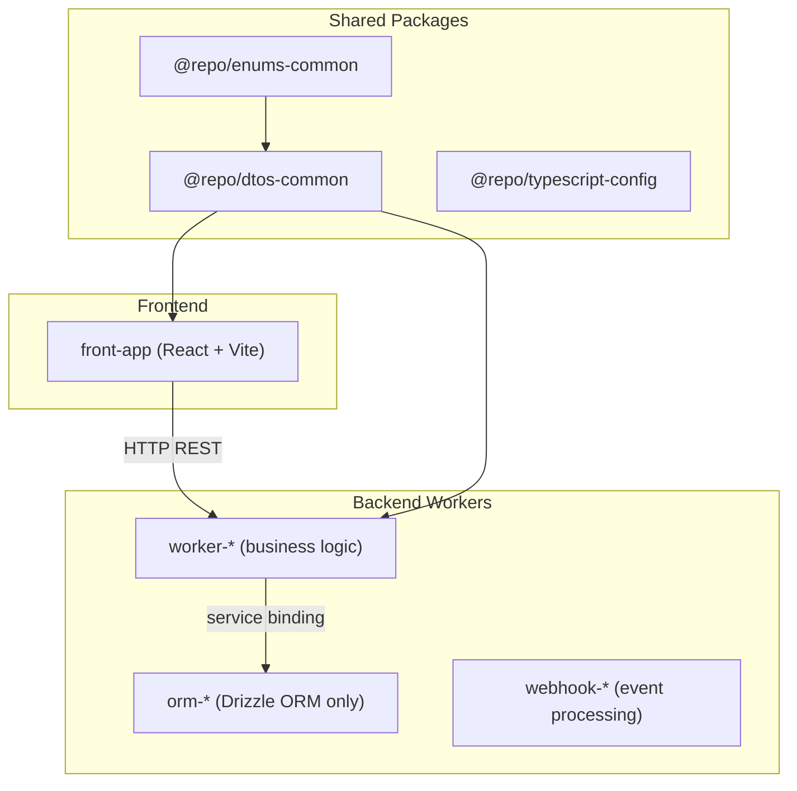

# Monorepo Agent Instructions

## Project Overview

A minimal, production-oriented monorepo built on **pnpm workspaces** with **Turborepo**, **Cloudflare Workers**, **Hono**, and a **React (Vite) frontend** styled with **Tailwind CSS v4**. `front-app` talks to backend Workers over **HTTP** when you add them; service bindings are the preferred pattern for Worker-to-Worker communication.

The application built on top of this monorepo is **Agentic GTM** — a Claude-orchestrated go-to-market intelligence engine. Read the next section before touching agent code: it is the source of truth for *what we are building and why*.

## What We're Building — Agentic GTM Intelligence

**In one sentence:** a sales team submits a **list of company domain names**, and the system returns a **ranked list of prospects with vendor-tailored sales use cases**, produced by Claude agents that run concurrently per domain.

For each submitted domain the system:

1. **Infers the technical stack from public DNS.** A custom, key-less tool resolves **NS, MX, and SPF/TXT** records to fingerprint the CDN/proxy, DNS provider, mail provider, CRM, SSO/IdP, and marketing SaaS a company runs — inferred **from the domain name alone**.
2. **Collects commercial signals and reconstructs the org graph** from the company's LinkedIn presence to identify the **key decision-makers** worth engaging — via **Sillage**.
3. **Enriches those decision-makers** with direct contact details — **email and phone** (including telephony-sourced numbers) — via **FullEnrich**.
4. **Ranks prospects by opportunity level** and **generates tailored sales use cases** for the vendor running the scan.

**Claude is both the orchestrator and the inference engine.** The system is hosted on **Cloudflare Workers** with **Cloudflare KV** as the storage layer, and built on the **Flue** agent framework (see [`apps/worker-agent`](apps/worker-agent/AGENTS.md)).

### Why the DNS signal matters (worked examples)

- **Cloudflare (as the vendor):** inspect NS / DNS records to see whether the prospect already proxies through Cloudflare, and infer SSO / Zero Trust posture. Not on Cloudflare → migration pitch; partially on → upsell.
- **A CRM vendor:** SPF/TXT `include:` entries and domain-verification tokens reveal **HubSpot vs Salesforce vs Marketo** — driving competitive-displacement or complementary arguments.

The output of the scan is a per-account brief: *what they run, who to call, how to reach them, and the argument that lands*.

### Agent topology

- **Orchestrator agent** — **Claude Opus 4.8**, moderate (medium) reasoning. Owns planning, delegation, ranking, and synthesis. Runs as a **Durable Object** so a batch survives isolate restarts and deploys.
- **Specialist sub-agents** — spawned **dynamically** by the orchestrator, each with its **own isolated context**, executing **concurrently**:
  - `techstack_prober` — calls the DNS/SPF tool, returns a normalized tech-stack fingerprint.
  - `signal_scout` — calls Sillage, returns commercial signals + candidate decision-makers.
  - `contact_enricher` — calls FullEnrich, returns verified email/phone per decision-maker.
- **Tools & MCP** — the DNS/SPF resolver is a Flue **tool** (`defineTool`); **Sillage** and **FullEnrich** are reached through **MCP clients / REST** from the sub-agents. **Both** the orchestrator and its sub-agents may invoke tools and MCP servers.
- **Idempotent trigger layer** — Cloudflare is the idempotency backbone: an `Idempotency-Key` → **KV** replay cache plus a **deterministic per-domain run id** mean a retried batch never double-charges enrichment or re-runs inference.



### Per-domain pipeline

Stages 1 and 2 run **concurrently**; stage 3 depends on stage 2 (it needs the decision-makers); many domains run in parallel; the orchestrator owns the final synthesis.

| # | Stage | Runner | Integration | Produces |
|---|-------|--------|-------------|----------|
| 1 | Tech-stack inference | `techstack_prober` | custom DNS/SPF tool | tech-stack fingerprint (proxy, mail, CRM, SSO, marketing) |
| 2 | Signals + org graph | `signal_scout` | Sillage | commercial signals + candidate decision-makers |
| 3 | Contact enrichment | `contact_enricher` | FullEnrich | email + phone per decision-maker |
| 4 | Score + synthesize | orchestrator (Opus 4.8) | — | opportunity rank + vendor-tailored sales use cases |

> **Status.** `apps/worker-agent` currently ships a **placeholder demo** (an `orchestrator` + `content_collector` returning `{ answer, sources[] }` on Workers-AI models). The topology above is the **target**; the demo agents/tools are the scaffold we evolve into it. Reaching **Claude Opus 4.8** is a deliberate change from the Workers-AI-only demo — route Anthropic models through **AI Gateway** for the same observability. See [apps/worker-agent/AGENTS.md](apps/worker-agent/AGENTS.md).

## Quick Start

```bash
make install    # dependencies + workspace links
make login      # Cloudflare (remote Worker features)
make prepare    # Husky pre-commit hooks
make dev        # all dev servers
```

Verify: `http://localhost:5174`.

After scaffolding a new worker under `apps/`, run `make install` before turbo commands.

## Architecture



| Package | Purpose |
|---------|---------|
| `@repo/dtos-common` | Shared Zod schemas — `src/api/*` (HTTP), `src/rpc/*`, `src/queue/*`, `src/webhook/*` |
| `@repo/enums-common` | Shared enumerations across apps/packages |
| `@repo/typescript-config` | TypeScript presets for Workers and Vite React |

## Worker Prefixes

| Prefix | Example | Role |
|--------|---------|------|
| `orm-` | `orm-account` | Drizzle schema + migrations only |
| `worker-` | `worker-crawling` | Business logic; calls ORM via bindings |
| `webhook-` | `webhook-clerk` | External webhook processing |
| `front-` | `front-app` | React SPA; HTTP to backend only |

## Where to Put Things

| Task | Location |
|------|---------|
| New HTTP route | `apps/worker-<name>/src/routes/<feature>.ts` → mount in `src/index.ts` |
| Request/response Zod schemas (HTTP) | `packages/dtos-common/src/api/<feature>.ts` |
| Service-binding RPC schemas | `packages/dtos-common/src/rpc/<feature>.ts` |
| Queue message schemas | `packages/dtos-common/src/queue/<feature>.ts` |
| Webhook payload schemas | `packages/dtos-common/src/webhook/<feature>.ts` |
| Shared enum values | `packages/enums-common/src/index.ts` |
| Worker-local enum | `apps/<worker>/src/enums/` |
| Frontend API service | `apps/front-app/src/services/<backend>/<feature>.ts` |
| Frontend page | `apps/front-app/src/pages/` + `src/routes/` (TanStack file routes) |
| Reusable UI / hooks | `apps/front-app/src/components/ui/`, `src/hooks/` |
| Worker bindings / config | `apps/<worker>/wrangler.jsonc` |
| Local dev secrets | `apps/<worker>/.dev.vars` (from `.dev.vars.example`) |

Queue-consuming workers use a dual-handler layout: `handlers/request.ts`, `handlers/message.ts`, shared `services/`, minimal `index.ts`.

## Port Allocation

| Service | Dev port | Config |
|---------|----------|--------|
| `front-app` | **5174** | Vite / `package.json` |
| `worker-agent` | **8788** | `wrangler.jsonc` → `dev.port` |

Reserved ranges: ORM 8700–8710, app workers 8720–8729, webhooks 8760–8769, frontends 5170–5179. `worker-agent` uses **8788** (Flue dev).

## Environment

Copy `.dev.vars.example` → `.dev.vars` per app before local runs. Never commit `.dev.vars` or real secrets — update `.dev.vars.example` when adding keys.

## Service Bindings

Worker-to-Worker calls use bindings in `wrangler.jsonc` (`services` array) and `env.BINDING` — zero latency, no public URL. **Do not** use bindings from `front-app`.

## Contract Change Workflow

1. Edit schemas in `packages/dtos-common/src/<layer>/` (`api`, `rpc`, `queue`, or `webhook`).
2. Update the backend worker route validation.
3. Update `front-app` parsing / forms.
4. Run `make check-types`.

Prefer **additive** changes. For breaking changes, version the route (e.g. `/api/v2/`) and migrate deliberately.

## Code Quality

Lint and format: `.oxlintrc.json` and `.oxfmtrc.json` at repo root (`make ci`). Naming, contracts, React, and Workers patterns load from **path-scoped** `.claude/rules/` when editing matching files. Unconditional guardrails: `.claude/rules/guardrails.md`.

TypeScript presets: see [packages/typescript-config/AGENTS.md](packages/typescript-config/AGENTS.md) — apps **extend** a preset; do not fork compiler options.

## Make Commands (root)

| Command | Description |
|---------|-------------|
| `make install` | Install and link workspace packages |
| `make dev` | Start all dev servers |
| `make ci` | Lint + format + check-types (run before PRs) |
| `make check-types` | TypeScript across all packages |
| `make types` | Generate `worker-configuration.d.ts` in apps |
| `make build` / `make deploy` | Build or deploy via Turborepo |
| `make format` / `make lint` | Fix formatting / lint issues |

Per-app commands: see each app's `AGENTS.md` or `Makefile`.

## Memory Layout (Claude Code + Cursor)

| Layer | Claude Code | Cursor |
|-------|-------------|--------|
| Global instructions | [CLAUDE.md](CLAUDE.md) (imports this file) | [AGENTS.md](AGENTS.md) (workspace rules) |
| Path-scoped rules | [`.claude/rules/`](.claude/rules/) (`*.md`) | [`.cursor/rules/`](.cursor/rules/) (`*.mdc`) |
| Hooks | [`.claude/settings.json`](.claude/settings.json) | [`.cursor/hooks.json`](.cursor/hooks.json) |
| Hook scripts (shared) | [`hooks/`](hooks/) | [`hooks/`](hooks/) |
| Subagents | [`.claude/agents/`](.claude/agents/) | [`.cursor/agents/`](.cursor/agents/) |
| Slash commands | — | [`.cursor/commands/`](.cursor/commands/) |
| MCP servers | [`.mcp.json`](.mcp.json) | [`.cursor/mcp.json`](.cursor/mcp.json) |
| Deep skills | [`.agents/skills/`](.agents/skills/) | same (shared) |
| Nested app guides | `CLAUDE.md` per app/package | `AGENTS.md` per app/package |

- Claude Code: nested `CLAUDE.md` in apps/packages load on demand; debug instruction loading with `tail -f hooks/logs/instructions-loaded.log`.
- Cursor: path-scoped rules attach by glob; debug hook activity in **Customize → Hooks** output channel; session logs in `hooks/logs/session-start.log`.
- **Keeping Claude + Cursor in sync:** when you edit a path-scoped rule or subagent, update the parallel file in the other folder (`.claude/rules/*.md` ↔ `.cursor/rules/*.mdc`, `.claude/agents/*.md` ↔ `.cursor/agents/*.md`). Hook scripts are canonical in [`hooks/`](hooks/); both tools reference that directory via their config files.

See [`.cursor/README.md`](.cursor/README.md) for a quick index of the Cursor setup.

## Agent Guides

| Focus | Guide | Claude entry |
|-------|-------|--------------|
| React SPA | [apps/front-app/AGENTS.md](apps/front-app/AGENTS.md) | [apps/front-app/CLAUDE.md](apps/front-app/CLAUDE.md) |
| Flue agent Worker | [apps/worker-agent/AGENTS.md](apps/worker-agent/AGENTS.md) | [apps/worker-agent/CLAUDE.md](apps/worker-agent/CLAUDE.md) |
| Zod DTOs | [packages/dtos-common/AGENTS.md](packages/dtos-common/AGENTS.md) | [packages/dtos-common/CLAUDE.md](packages/dtos-common/CLAUDE.md) |
| Shared enums | [packages/enums-common/AGENTS.md](packages/enums-common/AGENTS.md) | [packages/enums-common/CLAUDE.md](packages/enums-common/CLAUDE.md) |
| TS presets | [packages/typescript-config/AGENTS.md](packages/typescript-config/AGENTS.md) | [packages/typescript-config/CLAUDE.md](packages/typescript-config/CLAUDE.md) |
| Agent hooks | [hooks/AGENTS.md](hooks/AGENTS.md) | [hooks/CLAUDE.md](hooks/CLAUDE.md) |

Extend this table when adding a new app or package with its own guide.

## Decision Checklist

1. Schema already in `@repo/dtos-common`? Import it — don't redefine.
2. Enum already in `@repo/enums-common`? Import it — don't duplicate literals.
3. Worker-to-Worker call? Service binding, not HTTP.
4. Filename follows kebab-case? (PascalCase only for React `.tsx` components in `front-app`.)
5. Worker function under 100 lines? Extract helpers if not.
6. All imports used? oxlint errors on unused vars.

## Contribution

- Run `make ci` before opening a PR.
- Update the relevant `AGENTS.md` when adding endpoints, bindings, env vars, or conventions.
- HTTP contracts live in `@repo/dtos-common`; update backend workers and `front-app` together.
- Never commit secrets or real environment values.
