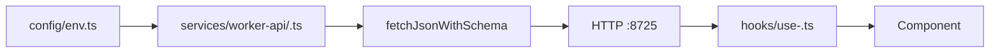

# Front App Agent Instructions

## Overview

`front-app` is the **React SPA** for the monorepo: **Vite**, **Tailwind CSS v4**, deployed as static assets + SPA routing on **Cloudflare Workers**. Communicates with **`worker-api` over HTTP only** — no service bindings.

- **Dev**: `http://localhost:5174`
- **API**: `worker-agent` Flue Worker — `http://localhost:8788` in dev, the deployed Worker in production (resolved in `src/config/env.ts` from `src/config/api-origin.ts`)

React, routing, and query patterns load from `.claude/rules/` when editing `src/**` (`react.md`, `tanstack-router.md`, `tanstack-query.md`, `frontend-architecture.md`). Use skills for depth.

## Tech Stack

React 19 + TypeScript, Vite + Cloudflare plugin, Tailwind v4, TanStack Router + Query, Zod + `@repo/dtos-common`, `fetchJsonWithSchema`, OXC, Wrangler.

## Structure (abbreviated)

```
apps/front-app/src/
├── routes/          # TanStack file routes (loaders, guards — thin)
├── pages/           # Page UI (imported by *.lazy.tsx)
├── services/worker-api/   # <feature>.ts + <feature>-query-options.ts
├── hooks/           # use-<feature>.ts
├── components/ui/   # Reusable primitives
├── config/          # env.ts, query-client.ts
├── utils/           # fetch-api.ts
└── enums/           # Frontend-only enums
```

## Where to Change Things

| Task | Location |
|------|---------|
| New page | `src/pages/<Page>.tsx` + `src/routes/<path>.tsx` + `src/routes/<path>.lazy.tsx` |
| Typed API call | `src/services/worker-api/<feature>.ts` |
| Query options | `src/services/worker-api/<feature>-query-options.ts` |
| UI primitive | `src/components/ui/<Name>.tsx` |
| Data hook | `src/hooks/use-<feature>.ts` |
| API base URL | `src/config/env.ts` (`VITE_API_BASE_URL`) |
| Frontend-only enum | `src/enums/<feature>.ts` |
| Shared enum | `packages/enums-common/src/index.ts` |
| SPA / deploy config | `wrangler.jsonc`, `vite.config.ts` |

## Integration Flow



**Never** hardcode `http://localhost:8725` outside `src/config/env.ts`.

## Environment

| Variable | Purpose |
|---------|---------|
| `VITE_API_BASE_URL` | **Optional** override of the `worker-agent` origin. Defaults are baked in per build mode (`src/config/api-origin.ts`): `http://localhost:8788` in dev, the deployed Worker in production — so `make dev` and `make deploy` work with **no env file** on any machine or CI. |

`VITE_*` vars are **inlined at build time** — changing the API URL requires rebuild + redeploy. `src/config/api-origin.ts` is the one source of truth for the default origins, imported by both `src/config/env.ts` (runtime) and `vite.config.ts` (the production build guard + generated CSP `connect-src`). A production build **fails** if the resolved origin is not an absolute `http(s)` URL.

Only set `VITE_API_BASE_URL` to point at a *different* backend (staging, a personal deployment). Put it in `.env.local` / `.env.production.local` or the shell — **never in `.env`**, which loads in every mode and would leak one environment's origin into the other (this is what breaks a local `make deploy`).

```bash
# Only needed to override the baked-in defaults:
cp .env.example .env.local              # dev override
cp .env.production.example .env.production   # production override
```

## Local Development

```bash
make dev                    # from repo root (front + API)
cd apps/front-app && make dev   # Vite on :5174 only
```

## Adding a Feature

1. Schemas in `packages/dtos-common/src/api/<feature>.ts`.
2. Route in `apps/worker-api/src/routes/<feature>.ts`.
3. Service `src/services/worker-api/<feature>.ts` with `fetchJsonWithSchema`.
4. Query options in `<feature>-query-options.ts` if using TanStack Query.
5. Hook `src/hooks/use-<feature>.ts`.
6. Page + eager/lazy routes under `src/pages/` and `src/routes/`.
7. `make ci`.

## fetchJsonWithSchema

All `worker-api` HTTP calls use `fetchJsonWithSchema` from `src/utils/fetch-api.ts`:

```typescript
import { fetchJsonWithSchema } from "@/utils/fetch-api";
import { HealthResponseSchema } from "@repo/dtos-common/api";
import { apiBaseUrl } from "@/config/env";

export async function getHealth() {
  return fetchJsonWithSchema(
    `${apiBaseUrl}/api/v1/health`,
    HealthResponseSchema,
  );
}
```

## Import Conventions

Import modules directly — no barrel re-exports in `src/enums/` or `src/services/worker-api/`:

```typescript
import { ApiHealthStatus } from "@enums/api-health-status";
import { getHealth } from "@/services/worker-api/health";
```

Query keys: `["worker-api", "<feature>", ...]` — colocate `queryOptions` next to the service module.

## Best Practices

- Never duplicate Zod wire schemas — use `@repo/dtos-common`.
- Never hardcode API origins outside `env.ts`.
- Lazy-load page UI via `*.lazy.tsx` + `src/pages/`; loaders stay in eager route files.
- Shared enums in `@repo/enums-common`; UI-only enums in `src/enums/`.
- Production builds need `VITE_API_BASE_URL` in `.env.production`.

## Commands

| Command | Description |
|---------|-------------|
| `make dev` | Vite on port 5174 |
| `make build` / `make preview` / `make deploy` | Build, preview, deploy |
| `make ci` | Lint + format + check-types |
| `pnpm analyze` | Bundle stats (`dist/stats.html`) |

## Contribution

Follow this file and root [AGENTS.md](../../AGENTS.md). Update HTTP contracts in `@repo/dtos-common` with `worker-api` in the same PR. Run `make ci` before merging.
