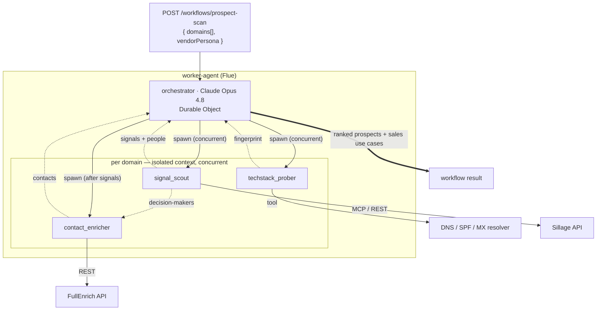
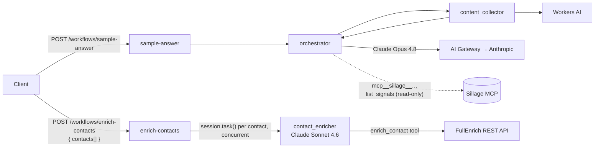

# Worker Agent Instructions

## Purpose

`worker-agent` is the **Agentic GTM** engine — a **Flue** Worker where a **Claude-orchestrated** agent turns a batch of company **domain names** into a **ranked list of prospects with vendor-tailored sales use cases**. It is the home of the orchestrator, its specialist sub-agents, and the tools/MCP clients they call.

Read the monorepo spec first: **[../../AGENTS.md → What We're Building](../../AGENTS.md#what-were-building--agentic-gtm-intelligence)**. This file is the worker-level design.

- **Dev:** `http://localhost:8788`
- **Auth:** **none (hackathon).** The `AGENT_API_KEY` guard was removed from `/agents/*`, `/workflows/*` and `/runs/:runId` so the `front-app` SPA can call this Worker directly; a strict `hono/cors` allowlist (`WEB_APP_ORIGIN` + localhost) replaces it. `middlewares/require-api-key.ts` is retained — re-wire it (app.ts + the workflow `runs` export) to restore fail-closed auth for any non-hackathon deployment.
- **Runtime:** Cloudflare Workers + Durable Objects (Flue) + Cloudflare KV (idempotency + result cache).

Flue patterns load from `.claude/rules/worker-agent.md` when editing `src/agents/**` or `src/workflows/**`. Load the `flue` skill for framework depth; the `sillage-help` / `sillage-api` skills for the Sillage integration.

> **Status.** The full agent design below now **ships as the `prospect-scan` workflow** — the orchestrator + all three specialists + the DNS tool + the Sillage read tools are implemented. The `sample-answer` / `enrich-contacts` demos remain as scaffold (reuse their wiring: auth, idempotency, Durable Objects, providers).

## Agent design

### Topology

| Role | Slug | Kind | Model | Job |
|------|------|------|-------|-----|
| Orchestrator | `orchestrator` | agent (Durable Object) | **Claude Opus 4.8**, medium reasoning | Plan the scan, delegate per domain, rank prospects, synthesize sales use cases |
| Sub-agent | `techstack_prober` | subagent profile (no DO) | **implemented** — Gemma 4 26B (Workers AI) | Call the DNS/SPF tool → normalized tech-stack fingerprint |
| Sub-agent | `signal_scout` | subagent profile (no DO) | **implemented** — Claude Sonnet 4.6 (AI Gateway) | Call Sillage (read-only MCP) → commercial signals + candidate decision-makers |
| Sub-agent | `contact_enricher` | subagent profile (no DO) | **implemented** — Claude Sonnet 4.6 (AI Gateway) | Call FullEnrich → verified email/phone per decision-maker |

### Integrations (tools & MCP)

| Integration | Reached via | Auth | Used by |
|-------------|-------------|------|---------|
| DNS / SPF / MX resolver | custom Flue **tool** `analyze_domain` (`src/tools/analyze-domain.ts`) → `worker-dns` RPC binding | none — key-less | `techstack_prober` |
| Sillage (LinkedIn signals + org graph) | **MCP client** (`src/mcp/sillage.ts`), read-only allow-list | `SILLAGE_API_KEY` (`sk_live_…`) | `signal_scout` |
| FullEnrich (email + phone) | REST tool (`defineTool`, `src/tools/full-enrich.ts`) | `FULLENRICH_API_KEY` | `contact_enricher` |

Each specialist also loads a matching Flue **skill** (`src/skills/`) that encodes how to drive its tool well: `dns-fingerprint`, `sillage-signals`, `contact-enrichment`, and `prospect-ranking` (orchestrator synthesis).

Bind authority (API keys, tenant) **in the tool**, never as a model-supplied parameter (Flue `tools.md`). Model-facing surfaces stay **read/query-oriented** — no credential creation or irreversible actions (see [guardrails.md](../../.claude/rules/guardrails.md)).

FullEnrich is REST-only here, not MCP: FullEnrich's public MCP server (`mcp.fullenrich.com`) authenticates via a browser-based OAuth connector flow ("no API keys or manual tokens required") meant for interactive Claude.ai/Desktop use — it has no static-API-key path a headless Worker can drive, so `contact_enricher` calls the documented bulk REST API (`app.fullenrich.com/api/v1/contact/enrich/bulk`) directly instead.

### Per-domain pipeline



| # | Stage | Runner | Depends on | Produces |
|---|-------|--------|-----------|----------|
| 1 | Tech-stack inference | `techstack_prober` | — | fingerprint: proxy/CDN, DNS, mail, CRM, SSO/IdP, marketing |
| 2 | Signals + org graph | `signal_scout` | — | commercial signals + candidate decision-makers |
| 3 | Contact enrichment | `contact_enricher` | stage 2 | email + phone per decision-maker |
| 4 | Score + synthesize | orchestrator | 1–3 | opportunity rank + vendor-tailored sales use cases |

Stages 1 and 2 run **concurrently**; stage 3 needs stage 2's people; **many domains run in parallel**; the orchestrator alone writes the final answer.

### Agent / sub-agent / tool relationships (the rules that matter)

- **The orchestrator spawns multiple sub-agents**, each with its **own independent context** — a sub-agent never sees the full batch, only its self-contained brief for one domain. This keeps context small and limits data exposure.
- **Sub-agents execute concurrently.** Fan out per domain and across the three specialists; do not serialize what has no data dependency.
- **Both the orchestrator and its sub-agents may call tools / MCP servers.** Give each sub-agent **only** the tool(s) its job needs (`techstack_prober` → DNS tool only, etc.).
- **Sub-agent output is untrusted until checked.** Validate shape with a schema and have the orchestrator sanity-check claims before ranking (Flue `subagents.md`).
- **The orchestrator owns synthesis.** Sub-agents return structured findings, never user-facing prose.

### Vendor-tailored use cases (why the DNS signal is the wedge)

The `vendorPersona` on the request steers stage 4. Examples:

- **Cloudflare vendor:** does the prospect's NS/DNS already point to Cloudflare? Infer proxy + SSO / Zero Trust posture → migration vs. upsell argument.
- **CRM vendor:** SPF/TXT `include:` + domain-verification tokens reveal HubSpot / Salesforce / Marketo → displacement or complement argument.

### Idempotency & durability

- **Cloudflare is the idempotent trigger layer.** `Idempotency-Key` on the workflow POST → **KV** replay cache (24h); derive a **deterministic per-domain run id** so a retried batch never re-runs inference or double-charges Sillage/FullEnrich.
- The orchestrator is a **Durable Object** — a batch survives isolate resets/deploys. Keep `durability.maxAttempts` low (paid inference re-runs on each interrupted attempt).

### Inference path

The **orchestrator** runs **Claude Opus 4.8** routed through **Cloudflare AI Gateway** for planning, delegation, ranking, and synthesis. **Specialist subagents** that drive MCP or lighter tool workflows (`signal_scout`, `contact_enricher`) use **Claude Sonnet 4.6** on the same gateway path (`CF_AIG_TOKEN`) — enough reasoning for multi-tool flows without Opus cost. There is no `claude-sonnet-5` entry in pi-ai's gateway catalog yet; Sonnet 4.6 is the latest available. **DNS probing + compaction** stay on **Workers AI** (`cloudflare/…`) through the `AI` binding (`src/providers/cloudflare-ai.ts`).

## What runs today

| Piece | Slug | Role |
|-------|------|------|
| Workflow | `prospect-scan` | **The pipeline.** `POST /workflows/prospect-scan` — `{ domains[], vendorPersona, vendorName? }`. Fans out per domain: `techstack_prober` + `signal_scout` concurrently, then `contact_enricher` on the surfaced people, then the orchestrator ranks + writes use cases. Validated against `ProspectScanOutputSchema`. |
| Subagent | `techstack_prober` | Calls `analyze_domain` (DNS/SPF via `worker-dns`), returns a `TechFingerprint` (no DO) — Gemma 4 26B, `dns-fingerprint` skill |
| Subagent | `signal_scout` | Calls the read-only Sillage MCP tools, returns `{ companyName, decisionMakers, signals }` (no DO) — Claude Sonnet 4.6 (AI Gateway), `sillage-signals` skill |
| Tool | `analyze_domain` | `src/tools/analyze-domain.ts` — resolves DNS/SPF/MX and fingerprints vendors via `env.DNS_WORKER.analyzeDomain`; key-less, read-only |
| Workflow | `sample-answer` | *(demo)* `POST /workflows/sample-answer` — validates input, runs orchestrator, validates output |
| Workflow | `enrich-contacts` | `POST /workflows/enrich-contacts` — validates a batch of named contacts, fans out one `contact_enricher` delegation per contact **concurrently** (`Promise.all` over `session.task(...)`), validates each result against `EnrichedContactSchema`. First full slice of the target `contact_enricher`. |
| Agent | `orchestrator` | Plans, delegates, synthesizes (Durable Object) — **Claude Opus 4.8** via AI Gateway (Anthropic upstream); compaction stays on Workers AI |
| Subagent | `content_collector` | Returns references + excerpts only (no DO) — placeholder for the GTM specialists |
| Subagent | `contact_enricher` | Calls the `enrich_contact` tool, returns one strictly-typed `EnrichedContact` (no DO) — Claude Sonnet 4.6 (AI Gateway) |
| Tool | `enrich_contact` | `src/tools/full-enrich.ts` — submits + polls FullEnrich's bulk REST API for one contact; `FULLENRICH_API_KEY` bound in the tool, never model-supplied; degrades to a structured `error` field (not a thrown exception) when unset, unreachable, or no match is found |
| MCP client | `sillage` | `src/mcp/sillage.ts` — `connectMcpServer` adapts Sillage's read-only tools (allow-listed: `get_company`/`get_company_mapping`/`list_company_mappings`/`get_lead`/`get_persona`/`get_agents`/`list_signals`/`get_signal`/`get_signal_playbook`/`get_signal_run`) into Flue tools; connected once in the orchestrator factory and handed to `signal_scout`. Skipped when `SILLAGE_API_KEY` is unset. |



## Structure

```
apps/worker-agent/src/
├── app.ts                 # Hono: auth, idempotency, health, flue()
├── agents/
│   ├── orchestrator.ts    # defineAgent + orchestrator.md (Claude Opus 4.8, prospect-ranking skill)
│   └── subagents/         # techstack-prober, signal-scout, contact-enricher, content-collector
├── workflows/
│   ├── prospect-scan.ts    # defineWorkflow — THE pipeline: per-domain fan-out + synthesis
│   ├── sample-answer.ts    # defineWorkflow + sample-answer.md (demo)
│   └── enrich-contacts.ts  # defineWorkflow — concurrent contact_enricher fan-out (demo)
├── tools/
│   ├── analyze-domain.ts   # defineTool analyze_domain — DNS/SPF via env.DNS_WORKER RPC
│   └── full-enrich.ts      # defineTool enrich_contact — FullEnrich bulk REST, valibot input/output
├── skills/                 # dns-fingerprint, sillage-signals, contact-enrichment, prospect-ranking
├── dtos/                   # valibot schemas (Flue input/output slots)
│   ├── prospect-scan/      # ProspectScanInput/Output, TechFingerprint, GtmSignal, RankedProspect, DNS mirror
│   └── contact-enrichment/ # ContactQuerySchema, EnrichedContactSchema, batch wrappers
├── providers/              # cloudflare-ai.ts, anthropic-gateway.ts
├── middlewares/            # require-api-key, idempotency, mutable-response
├── routes/                 # /, /health
├── enums/                  # Model, ThinkingLevel (worker-local)
├── lib/                    # prospect-scan-briefs, full-enrich-client, contact-task-message, timing-safe-equal
└── mcp/                    # sillage.ts (connectMcpServer, read-only allow-list); FullEnrich stays REST
```

All target pieces now exist: `src/tools/analyze-domain.ts` (DNS/SPF resolver, service-bound to `worker-dns`), the `techstack_prober` / `signal_scout` subagents, the `src/skills/**` skills, and the `src/workflows/prospect-scan.ts` workflow (`src/lib/prospect-scan-briefs.ts` holds its brief builders).

## Where to change things

| Task | Location |
|------|----------|
| Orchestrator prompt / config | `src/agents/orchestrator.ts`, `orchestrator.md` |
| Sub-agent prompt / config | `src/agents/subagents/<name>.ts`, `.md` (+ pass to `subagents:` in `orchestrator.ts`) |
| Workflow + brief | `src/workflows/<name>.ts`, `.md` (export `route`/`runs`, append a DO migration) |
| Workflow input/output shapes | `src/dtos/**` (valibot — Flue slots) |
| Tool-usage skill (per specialist) | `src/skills/<name>/SKILL.md` (+ pass to `skills:` in the agent/subagent) |
| Custom tool (DNS/SPF, FullEnrich) | `src/tools/**` — `defineTool`, keep authority in the tool |
| MCP client (Sillage) | `src/mcp/**` (read-only allow-list) |
| HTTP middleware / app wiring | `src/middlewares/**`, `src/app.ts` |
| Models | `src/enums/model.ts`, `src/providers/cloudflare-ai.ts` |
| Bindings / vars / DO migrations | `wrangler.jsonc` → rebuild with `pnpm build` |

## Build & deploy

`wrangler.jsonc` is the **source** config. `flue build --target cloudflare` writes **`dist/worker_agent/wrangler.json`** — deploy that file, never the source. Do not hand-edit `dist/**` or `.flue-vite/**`.

Durable Objects (append-only migrations in `wrangler.jsonc` — never rewrite an existing tag):

| Tag | Classes |
|-----|---------|
| `v1` | `FlueRegistry`, `FlueOrchestratorAgent` |
| `v2` | `FlueSampleAnswerWorkflow` |
| `v3` | `FlueEnrichContactsWorkflow` |
| `v4` | `FlueProspectScanWorkflow` |

Adding a new workflow or orchestrator DO means appending a new tag (`v5`, …). Sub-agents create **no** DO — `techstack_prober`, `signal_scout`, and `contact_enricher` added no migration.

## Environment

Copy `apps/worker-agent/.dev.vars.example` → `.dev.vars` (gitignored). Never commit secrets; update `.dev.vars.example` when adding keys.

| Name | Kind | Purpose |
|------|------|---------|
| `WEB_APP_ORIGIN` | var | Browser origin allowed by CORS (the `front-app` SPA); `localhost:5174`/`:4174` are always allowed in code |
| `AGENT_API_KEY` | secret | Inbound API key — **unused (hackathon)**; the auth guard was removed. Re-wire `middlewares/require-api-key.ts` to re-enable |
| `AI` | binding | Workers AI — subagents + compaction inference |
| `IDEMPOTENCY_KV` | KV | `Idempotency-Key` replay cache (24h) + per-domain result cache |
| `AI_GATEWAY_ID` | var | Gateway id (`default` = implicit gateway); used for both the `AI` binding and the Anthropic endpoint URL |
| `CF_ACCOUNT_ID` | var | Cloudflare account id — builds the AI Gateway Anthropic endpoint URL (`src/providers/anthropic-gateway.ts`) |
| `ENVIRONMENT` | var | `production` / `dev` |
| `CF_AIG_TOKEN` | secret | AI Gateway authorization token (`cf-aig-authorization`) for the orchestrator's Claude Opus 4.8 calls. **Required** for the orchestrator; the gateway holds the Anthropic credentials (BYOK / Unified Billing), so no Anthropic key is stored here |
| `SILLAGE_API_KEY` | secret | Sillage (`sk_live_…`) — static bearer for the Sillage MCP client (`src/mcp/sillage.ts`). Optional; unset → `signal_scout` runs with no Sillage tools and reports it has no signal source |
| `FULLENRICH_API_KEY` | secret | FullEnrich bearer key for the `enrich_contact` tool (`src/tools/full-enrich.ts`). Optional; unset → the tool returns a structured `error` instead of calling FullEnrich |
| `ANTHROPIC_API_KEY` | secret | **Unused** — all Claude models route through AI Gateway (`CF_AIG_TOKEN`). Kept in `.dev.vars.example` only for local experiments with direct `anthropic/...` models. |

## HTTP surface

| Method / path | Auth | Description |
|---------------|------|-------------|
| `POST /workflows/sample-answer` | none | *(demo)* `{ question }` → `{ answer, sources[] }`; `?wait=result` for sync |
| `POST /workflows/enrich-contacts` | none | `{ contacts[] }` → `{ contacts: EnrichedContact[] }`; one `contact_enricher` delegation per contact, run concurrently; `?wait=result` for sync |
| `POST /workflows/prospect-scan` | none | `{ domains[], vendorPersona, vendorName? }` → `{ prospects[], summary }` (ranked prospects + tailored sales use cases); `?wait=result` for sync |
| `GET /runs/:runId` | none | Workflow run detail |
| `POST /agents/orchestrator/:id` | none | Conversational agent (`?wait=result` for sync) |
| `GET /agents/orchestrator/:id` | none | SSE stream |
| `GET /health`, `GET /` | no | Health + service descriptor |

Flue schema slots use **valibot**; other app boundaries stay on **Zod 4**. Send `Idempotency-Key` on workflow POST to dedupe retries.

## Commands

```bash
pnpm --filter worker-agent dev      # flue dev — :8788
pnpm --filter worker-agent test     # unit tests
pnpm --filter worker-agent evals    # live-model evals (needs running dev server)
pnpm --filter worker-agent build    # → dist/worker_agent/wrangler.json
pnpm --filter worker-agent deploy   # build + wrangler deploy generated config
pnpm --filter worker-agent types    # worker-configuration.d.ts
pnpm --filter worker-agent ci       # lint + format + check-types
```

## Conventions

- Kebab-case filenames; functions ≤ 100 lines.
- Worker-local enums in `src/enums/`; shared HTTP headers in `@repo/enums-common`.
- Do not duplicate wire schemas from `@repo/dtos-common` unless they cross an app boundary — workflow DTOs here are Flue-internal (valibot).
- Give each sub-agent only the tools it needs; keep credentials in tools, not in model arguments.
- Default new subagents to Workers AI (`cloudflare/...`) or Claude Sonnet 4.6 via AI Gateway for MCP/tool specialists. Reserve Opus for the orchestrator only.
- Run `make ci` from the repo root before merging.

## Contribution

Follow this file and root [AGENTS.md](../../AGENTS.md). Update `wrangler.jsonc` migrations when adding agents/workflows that need new Durable Objects. Keep the **Target vs. today** split honest — when a target piece ships, move it out of "target" and update the tables. Run `make ci` before opening a PR.
