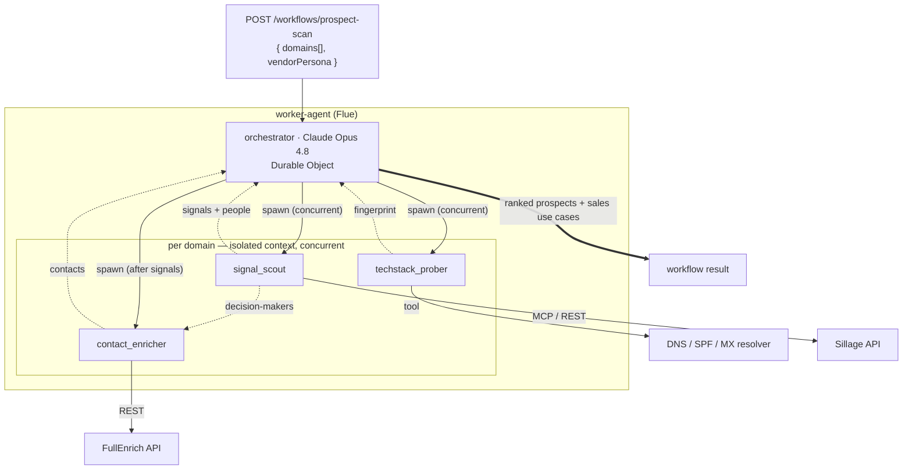
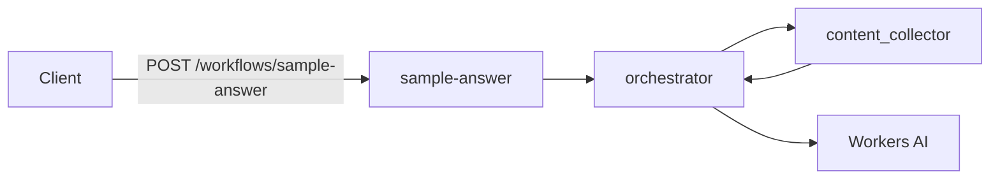

# Worker Agent Instructions

## Purpose

`worker-agent` is the **Agentic GTM** engine — a **Flue** Worker where a **Claude-orchestrated** agent turns a batch of company **domain names** into a **ranked list of prospects with vendor-tailored sales use cases**. It is the home of the orchestrator, its specialist sub-agents, and the tools/MCP clients they call.

Read the monorepo spec first: **[../../AGENTS.md → What We're Building](../../AGENTS.md#what-were-building--agentic-gtm-intelligence)**. This file is the worker-level design.

- **Dev:** `http://localhost:8788`
- **Auth:** `AGENT_API_KEY` on `/agents/*`, `/workflows/*`, `/runs/:runId` (`X-API-Key` or `Authorization: Bearer`) — fail-closed (`503` when unset).
- **Runtime:** Cloudflare Workers + Durable Objects (Flue) + Cloudflare KV (idempotency + result cache).

Flue patterns load from `.claude/rules/worker-agent.md` when editing `src/agents/**` or `src/workflows/**`. Load the `flue` skill for framework depth; the `sillage-help` / `sillage-api` skills for the Sillage integration.

> **Target vs. today.** The **Target agent design** below is what we are building. **What runs today** is a placeholder Flue demo (`orchestrator` + `content_collector` → `{ answer, sources[] }`) that we evolve into the target — reuse its wiring (auth, idempotency, Durable Objects, providers) rather than rebuilding it.

## Target agent design

### Topology

| Role | Slug | Kind | Model (target) | Job |
|------|------|------|----------------|-----|
| Orchestrator | `orchestrator` | agent (Durable Object) | **Claude Opus 4.8**, medium reasoning | Plan the scan, spawn sub-agents per domain, rank prospects, synthesize sales use cases |
| Sub-agent | `techstack_prober` | subagent profile (no DO) | small/fast | Call the DNS/SPF tool → normalized tech-stack fingerprint |
| Sub-agent | `signal_scout` | subagent profile (no DO) | mid | Call Sillage → commercial signals + candidate decision-makers |
| Sub-agent | `contact_enricher` | subagent profile (no DO) | small/fast | Call FullEnrich → verified email/phone per decision-maker |

### Integrations (tools & MCP)

| Integration | Reached via | Auth | Used by |
|-------------|-------------|------|---------|
| DNS / SPF / MX resolver | custom Flue **tool** (`defineTool`, DNS-over-HTTPS) | none — key-less | `techstack_prober` |
| Sillage (LinkedIn signals + org graph) | **MCP client** (`src/mcp/`) or REST | `SILLAGE_API_KEY` (`sk_live_…`) | `signal_scout` |
| FullEnrich (email + phone) | REST tool / MCP client | `FULLENRICH_API_KEY` | `contact_enricher` |

Bind authority (API keys, tenant) **in the tool**, never as a model-supplied parameter (Flue `tools.md`). Model-facing surfaces stay **read/query-oriented** — no credential creation or irreversible actions (see [guardrails.md](../../.claude/rules/guardrails.md)).

### Per-domain pipeline



| # | Stage | Runner | Depends on | Produces |
|---|-------|--------|-----------|----------|
| 1 | Tech-stack inference | `techstack_prober` | — | fingerprint: proxy/CDN, DNS, mail, CRM, SSO/IdP, marketing |
| 2 | Signals + org graph | `signal_scout` | — | commercial signals + candidate decision-makers |
| 3 | Contact enrichment | `contact_enricher` | stage 2 | email + phone per decision-maker |
| 4 | Score + synthesize | orchestrator | 1–3 | opportunity rank + vendor-tailored sales use cases |

Stages 1 and 2 run **concurrently**; stage 3 needs stage 2's people; **many domains run in parallel**; the orchestrator alone writes the final answer.

### Agent / sub-agent / tool relationships (the rules that matter)

- **The orchestrator spawns multiple sub-agents**, each with its **own independent context** — a sub-agent never sees the full batch, only its self-contained brief for one domain. This keeps context small and limits data exposure.
- **Sub-agents execute concurrently.** Fan out per domain and across the three specialists; do not serialize what has no data dependency.
- **Both the orchestrator and its sub-agents may call tools / MCP servers.** Give each sub-agent **only** the tool(s) its job needs (`techstack_prober` → DNS tool only, etc.).
- **Sub-agent output is untrusted until checked.** Validate shape with a schema and have the orchestrator sanity-check claims before ranking (Flue `subagents.md`).
- **The orchestrator owns synthesis.** Sub-agents return structured findings, never user-facing prose.

### Vendor-tailored use cases (why the DNS signal is the wedge)

The `vendorPersona` on the request steers stage 4. Examples:

- **Cloudflare vendor:** does the prospect's NS/DNS already point to Cloudflare? Infer proxy + SSO / Zero Trust posture → migration vs. upsell argument.
- **CRM vendor:** SPF/TXT `include:` + domain-verification tokens reveal HubSpot / Salesforce / Marketo → displacement or complement argument.

### Idempotency & durability

- **Cloudflare is the idempotent trigger layer.** `Idempotency-Key` on the workflow POST → **KV** replay cache (24h); derive a **deterministic per-domain run id** so a retried batch never re-runs inference or double-charges Sillage/FullEnrich.
- The orchestrator is a **Durable Object** — a batch survives isolate resets/deploys. Keep `durability.maxAttempts` low (paid inference re-runs on each interrupted attempt).

### Inference path

Target model calls route through **AI Gateway** (caching + observability), with **Anthropic** as the upstream for the orchestrator's Claude Opus 4.8. This is a deliberate change from the current Workers-AI-only demo: implementing it means updating `src/enums/model.ts`, `src/providers/`, and the `wrangler.jsonc` bindings/secrets (out of scope for docs-only changes — do it in the implementation PR). Sub-agents may stay on cheaper/faster models.

## What runs today (demo scaffold)

| Piece | Slug | Role |
|-------|------|------|
| Workflow | `sample-answer` | `POST /workflows/sample-answer` — validates input, runs orchestrator, validates output |
| Agent | `orchestrator` | Plans, delegates, synthesizes (Durable Object) — currently Kimi K2.6 on Workers AI |
| Subagent | `content_collector` | Returns references + excerpts only (no DO) — placeholder for the GTM specialists |



## Structure

```
apps/worker-agent/src/
├── app.ts                 # Hono: auth, idempotency, health, flue()
├── agents/
│   ├── orchestrator.ts    # defineAgent + orchestrator.md
│   └── subagents/         # content-collector (defineAgentProfile)
│                          #   → target: techstack-prober, signal-scout, contact-enricher
├── workflows/
│   └── sample-answer.ts   # defineWorkflow + sample-answer.md (→ target: prospect-scan)
├── dtos/                  # valibot schemas (Flue input/output slots)
├── providers/             # cloudflare-ai.ts (AI Gateway registration)
├── middlewares/           # require-api-key, idempotency, mutable-response
├── routes/                # /, /health
├── enums/                 # Model, ThinkingLevel (worker-local)
├── lib/                   # timing-safe-equal
└── mcp/                   # scaffold for MCP clients (→ Sillage, FullEnrich)
```

Target additions (not yet present): `src/tools/` for the DNS/SPF resolver and FullEnrich REST tool.

## Where to change things

| Task | Location |
|------|----------|
| Orchestrator prompt / config | `src/agents/orchestrator.ts`, `orchestrator.md` |
| Sub-agent prompt / config | `src/agents/subagents/<name>.ts`, `.md` (+ pass to `subagents:` in `orchestrator.ts`) |
| Workflow + brief | `src/workflows/<name>.ts`, `.md` (export `route`/`runs`, append a DO migration) |
| Workflow input/output shapes | `src/dtos/**` (valibot — Flue slots) |
| Custom tool (DNS/SPF, FullEnrich) | `src/tools/**` (target) — `defineTool`, keep authority in the tool |
| MCP client (Sillage, FullEnrich) | `src/mcp/**` |
| HTTP middleware / app wiring | `src/middlewares/**`, `src/app.ts` |
| Models | `src/enums/model.ts`, `src/providers/cloudflare-ai.ts` |
| Bindings / vars / DO migrations | `wrangler.jsonc` → rebuild with `pnpm build` |

## Build & deploy

`wrangler.jsonc` is the **source** config. `flue build --target cloudflare` writes **`dist/worker_agent/wrangler.json`** — deploy that file, never the source. Do not hand-edit `dist/**` or `.flue-vite/**`.

Durable Objects (append-only migrations in `wrangler.jsonc` — never rewrite an existing tag):

| Tag | Classes |
|-----|---------|
| `v1` | `FlueRegistry`, `FlueOrchestratorAgent` |
| `v2` | `FlueSampleAnswerWorkflow` |

Adding the `prospect-scan` workflow or a new orchestrator DO means appending a new tag (`v3`, …). Sub-agents create **no** DO.

## Environment

Copy `apps/worker-agent/.dev.vars.example` → `.dev.vars` (gitignored). Never commit secrets; update `.dev.vars.example` when adding keys.

| Name | Kind | Purpose |
|------|------|---------|
| `AGENT_API_KEY` | secret | Inbound API key; unset → `503` on guarded routes |
| `AI` | binding | Workers AI (current demo inference) |
| `IDEMPOTENCY_KV` | KV | `Idempotency-Key` replay cache (24h) + per-domain result cache |
| `AI_GATEWAY_ID` | var | Gateway id (`default` = implicit gateway) |
| `ENVIRONMENT` | var | `production` / `dev` |
| `SILLAGE_API_KEY` | secret | **target** — Sillage v2 (`sk_live_…`) for `signal_scout` |
| `FULLENRICH_API_KEY` | secret | **target** — FullEnrich for `contact_enricher` |
| `ANTHROPIC_API_KEY` | secret | **target** — Anthropic upstream via AI Gateway for Claude Opus 4.8 |

## HTTP surface

| Method / path | Auth | Description |
|---------------|------|-------------|
| `POST /workflows/sample-answer` | yes | *(demo)* `{ question }` → `{ answer, sources[] }`; `?wait=result` for sync |
| `POST /workflows/prospect-scan` | yes | **target** — `{ domains[], vendorPersona }` → ranked prospects + sales use cases |
| `GET /runs/:runId` | yes | Workflow run detail |
| `POST /agents/orchestrator/:id` | yes | Conversational agent (`?wait=result` for sync) |
| `GET /agents/orchestrator/:id` | yes | SSE stream |
| `GET /health`, `GET /` | no | Health + service descriptor |

Flue schema slots use **valibot**; other app boundaries stay on **Zod 4**. Send `Idempotency-Key` on workflow POST to dedupe retries.

## Commands

```bash
pnpm --filter worker-agent dev      # flue dev — :8788
pnpm --filter worker-agent test     # unit tests
pnpm --filter worker-agent evals    # live-model evals (needs running dev server)
pnpm --filter worker-agent build    # → dist/worker_agent/wrangler.json
pnpm --filter worker-agent deploy   # build + wrangler deploy generated config
pnpm --filter worker-agent types    # worker-configuration.d.ts
pnpm --filter worker-agent ci       # lint + format + check-types
```

## Conventions

- Kebab-case filenames; functions ≤ 100 lines.
- Worker-local enums in `src/enums/`; shared HTTP headers in `@repo/enums-common`.
- Do not duplicate wire schemas from `@repo/dtos-common` unless they cross an app boundary — workflow DTOs here are Flue-internal (valibot).
- Give each sub-agent only the tools it needs; keep credentials in tools, not in model arguments.
- Run `make ci` from the repo root before merging.

## Contribution

Follow this file and root [AGENTS.md](../../AGENTS.md). Update `wrangler.jsonc` migrations when adding agents/workflows that need new Durable Objects. Keep the **Target vs. today** split honest — when a target piece ships, move it out of "target" and update the tables. Run `make ci` before opening a PR.
