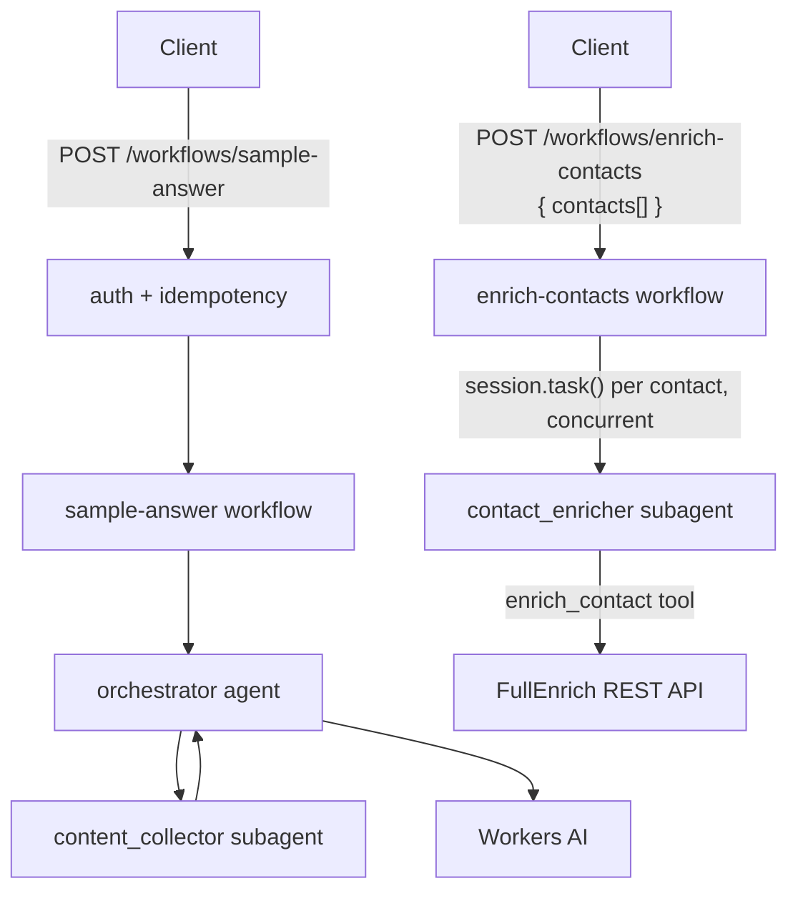

# worker-agent

The **Agentic GTM** engine — a **Flue** agent Worker where a **Claude-orchestrated** agent turns a batch of company **domain names** into a **ranked list of prospects with vendor-tailored sales use cases**. Concurrently, per domain, it infers the technical stack from DNS/SPF, surfaces buying signals and decision-makers from LinkedIn (**Sillage**), and enriches those people with email/phone (**FullEnrich**) — then the orchestrator (**Claude Opus 4.8**) ranks and drafts the pitch.

> **Status:** what ships today is a placeholder Flue demo — an **orchestrator → subagent → workflow** chain that accepts a question, delegates to a `content_collector` subagent, and returns a structured `{ answer, sources[] }` (Workers-AI models, no external LLM key). It is the scaffold we evolve into the target above. The full design lives in **[AGENTS.md](./AGENTS.md)** and **[../../AGENTS.md](../../AGENTS.md)**.

**Local dev:** `http://localhost:8788` — see [Getting started](#getting-started).

## Architecture



| Component | Slug | Model |
|-----------|------|-------|
| Orchestrator | `orchestrator` | Kimi K2.6 (Workers AI) |
| Subagent | `content_collector` | Gemma 4 26B (Workers AI) |
| Subagent | `contact_enricher` | Claude Haiku 4.5 (Anthropic — the app's one non-Workers-AI model, see [AGENTS.md](./AGENTS.md)) |

_The orchestrator/content_collector chain and enrich-contacts/contact_enricher chain are the two implemented slices. The full target GTM topology — orchestrator (Claude Opus 4.8) + `techstack_prober` / `signal_scout` sub-agents over the DNS-SPF tool and Sillage — is specified in [AGENTS.md → Target agent design](./AGENTS.md#target-agent-design)._

## Endpoints

All routes except `/` and `/health` require `AGENT_API_KEY` (`X-API-Key` or `Authorization: Bearer`).

| Method / path | Description |
|---------------|-------------|
| `POST /workflows/sample-answer` | Main entry — `{ question }` → `{ answer, sources[] }` |
| `POST /workflows/enrich-contacts` | `{ contacts[] }` → `{ contacts: EnrichedContact[] }`, enriched concurrently via FullEnrich |
| `GET /runs/:runId` | Workflow run status |
| `POST /agents/orchestrator/:id` | Drive the agent directly |
| `GET /agents/orchestrator/:id` | Agent event stream |
| `GET /health` | `{ status: "ok" }` |

Add `?wait=result` on workflow or agent POST for a synchronous response. Send `Idempotency-Key` on workflow POST to dedupe retries (24h KV cache).

## Getting started

**Prerequisites:** Node ≥ 22, pnpm 10, Cloudflare account for deploy.

```sh
# From repo root
make install
cp apps/worker-agent/.dev.vars.example apps/worker-agent/.dev.vars
# Set AGENT_API_KEY in .dev.vars (openssl rand -base64 32)

pnpm --filter worker-agent dev     # http://localhost:8788
pnpm --filter worker-agent test    # unit tests
pnpm --filter worker-agent build   # dist/worker_agent/wrangler.json
pnpm --filter worker-agent deploy  # build + deploy generated config
```

## Configuration

Source config: `wrangler.jsonc`. **`flue build`** injects the Worker entrypoint and Durable Object bindings into `dist/worker_agent/wrangler.json` — deploy that generated file.

| Binding / var | Purpose |
|---------------|---------|
| `AI` | Workers AI inference |
| `IDEMPOTENCY_KV` | Idempotency replay cache |
| `AI_GATEWAY_ID` | Gateway id (`default`) |
| `AGENT_API_KEY` | Inbound API key (secret / `.dev.vars`) |
| `SILLAGE_API_KEY` | Sillage API key (secret / `.dev.vars`) |
| `FULLENRICH_API_KEY` | FullEnrich API key for the `enrich_contact` tool (secret / `.dev.vars`) |
| `ANTHROPIC_API_KEY` | `contact_enricher`'s model (`anthropic/claude-haiku-4-5`, secret / `.dev.vars`) |

Durable Objects: `v1` → `FlueRegistry` + `FlueOrchestratorAgent`; `v2` → `FlueSampleAnswerWorkflow`; `v3` → `FlueEnrichContactsWorkflow`.

## Project layout

```
src/
├── agents/                    orchestrator + content_collector, contact_enricher subagents
├── workflows/                 sample-answer, enrich-contacts
├── tools/                     enrich_contact (defineTool, FullEnrich REST)
├── dtos/sample/, contact-enrichment/  valibot workflow/tool schemas
├── lib/                       full-enrich-client, contact-task-message, timing-safe-equal
├── middlewares/                API key guard, idempotency
├── providers/                  Workers AI registration
├── routes/                     health + service descriptor
└── mcp/                        sillage.ts (connectMcpServer)
```

See [AGENTS.md](./AGENTS.md) for the full agent guide and [../../AGENTS.md](../../AGENTS.md) for monorepo conventions.
