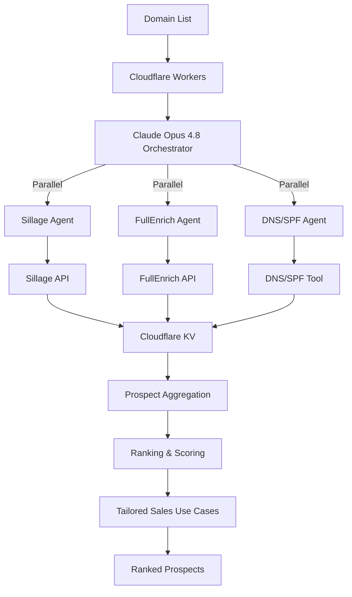

# worker-agent

The **Agentic GTM** engine — a **Flue** agent Worker where a **Claude-orchestrated** agent turns a batch of company **domain names** into a **ranked list of prospects with vendor-tailored sales use cases**. Concurrently, per domain, it infers the technical stack from DNS/SPF, surfaces buying signals and decision-makers from LinkedIn (**Sillage**), and enriches those people with email/phone (**FullEnrich**) — then the orchestrator (**Claude Opus 4.8**) ranks and drafts the pitch.

> **Status:** the full GTM pipeline now ships as the single **`prospect-scan`** workflow — the orchestrator (**Claude Opus 4.8**) fans out per domain to the `techstack_prober`, `signal_scout`, and `contact_enricher` specialists, then ranks accounts and writes vendor-tailored sales use cases. The earlier `sample-answer` / `enrich-contacts` demos remain as scaffold. The full design lives in **[AGENTS.md](./AGENTS.md)** and **[../../AGENTS.md](../../AGENTS.md)**.

**Local dev:** `http://localhost:8788` — see [Getting started](#getting-started).

## Architecture

One workflow runs the whole pipeline: domains in, ranked prospects out.



In Flue terms: `signal_scout` (Sillage), `contact_enricher` (FullEnrich), and `techstack_prober` (DNS/SPF) are the three specialist subagents; stages 1 (DNS) and 2 (Sillage) run concurrently per domain, stage 3 (enrichment) depends on stage 2's people, and the orchestrator alone performs aggregation, ranking, and use-case synthesis. See [AGENTS.md → Per-domain pipeline](./AGENTS.md#per-domain-pipeline).

| Component | Slug | Model | Job |
|-----------|------|-------|-----|
| Orchestrator | `orchestrator` | Claude Opus 4.8 (AI Gateway) | Plan, delegate, rank, synthesize |
| Subagent | `techstack_prober` | Gemma 4 26B (Workers AI) | DNS/SPF → tech-stack fingerprint |
| Subagent | `signal_scout` | Claude Sonnet 4.6 (AI Gateway) | Sillage → signals + decision-makers |
| Subagent | `contact_enricher` | Claude Sonnet 4.6 (AI Gateway) | FullEnrich → email + phone |
| Subagent | `content_collector` | Gemma 4 26B (Workers AI) | Demo `sample-answer` research (scaffold) |

## Endpoints

Hackathon: the `AGENT_API_KEY` guard is disabled so the browser SPA can call this Worker directly, behind a strict CORS allowlist (`WEB_APP_ORIGIN` + localhost). `/` and `/health` stay public. Re-wire `middlewares/require-api-key.ts` to restore fail-closed auth.

| Method / path | Description |
|---------------|-------------|
| `POST /workflows/prospect-scan` | **Main entry** — `{ domains[], vendorPersona, vendorName? }` → `{ prospects[], summary }`, ranked with tailored sales use cases |
| `POST /workflows/sample-answer` | *(demo)* `{ question }` → `{ answer, sources[] }` |
| `POST /workflows/enrich-contacts` | *(demo)* `{ contacts[] }` → `{ contacts: EnrichedContact[] }`, enriched concurrently via FullEnrich |
| `GET /runs/:runId` | Workflow run status |
| `POST /agents/orchestrator/:id` | Drive the agent directly |
| `GET /agents/orchestrator/:id` | Agent event stream |
| `GET /health` | `{ status: "ok" }` |

Add `?wait=result` on workflow or agent POST for a synchronous response. Send `Idempotency-Key` on workflow POST to dedupe retries (24h KV cache).

## Getting started

**Prerequisites:** Node ≥ 22, pnpm 10, Cloudflare account for deploy.

```sh
# From repo root
make install
cp apps/worker-agent/.dev.vars.example apps/worker-agent/.dev.vars
# Set AGENT_API_KEY in .dev.vars (openssl rand -base64 32)

pnpm --filter worker-agent dev     # http://localhost:8788
pnpm --filter worker-agent test    # unit tests
pnpm --filter worker-agent build   # dist/worker_agent/wrangler.json
pnpm --filter worker-agent deploy  # build + deploy generated config
```

## Configuration

Source config: `wrangler.jsonc`. **`flue build`** injects the Worker entrypoint and Durable Object bindings into `dist/worker_agent/wrangler.json` — deploy that generated file.

| Binding / var | Purpose |
|---------------|---------|
| `AI` | Workers AI inference |
| `IDEMPOTENCY_KV` | Idempotency replay cache |
| `AI_GATEWAY_ID` | Gateway id (`default`) |
| `AGENT_API_KEY` | Inbound API key (secret / `.dev.vars`) |
| `SILLAGE_API_KEY` | Sillage API key (secret / `.dev.vars`) |
| `FULLENRICH_API_KEY` | FullEnrich API key for the `enrich_contact` tool (secret / `.dev.vars`) |
| `ANTHROPIC_API_KEY` | Optional — unused; Claude models go through AI Gateway (`CF_AIG_TOKEN`) |

Durable Objects: `v1` → `FlueRegistry` + `FlueOrchestratorAgent`; `v2` → `FlueSampleAnswerWorkflow`; `v3` → `FlueEnrichContactsWorkflow`; `v4` → `FlueProspectScanWorkflow`.

## Project layout

```
src/
├── agents/                    orchestrator + subagents: techstack-prober, signal-scout,
│                              contact-enricher, content-collector
├── workflows/                 prospect-scan (the pipeline), sample-answer, enrich-contacts
├── tools/                     analyze-domain (DNS/SPF via worker-dns RPC), enrich_contact (FullEnrich REST)
├── skills/                    dns-fingerprint, sillage-signals, contact-enrichment, prospect-ranking
├── dtos/prospect-scan/, sample/, contact-enrichment/   valibot workflow/tool schemas
├── lib/                       prospect-scan-briefs, full-enrich-client, contact-task-message, ...
├── middlewares/                API key guard, idempotency
├── providers/                  Workers AI + Anthropic-gateway registration
├── routes/                     health + service descriptor
└── mcp/                        sillage.ts (connectMcpServer — read-only tools for signal_scout)
```

See [AGENTS.md](./AGENTS.md) for the full agent guide and [../../AGENTS.md](../../AGENTS.md) for monorepo conventions.
