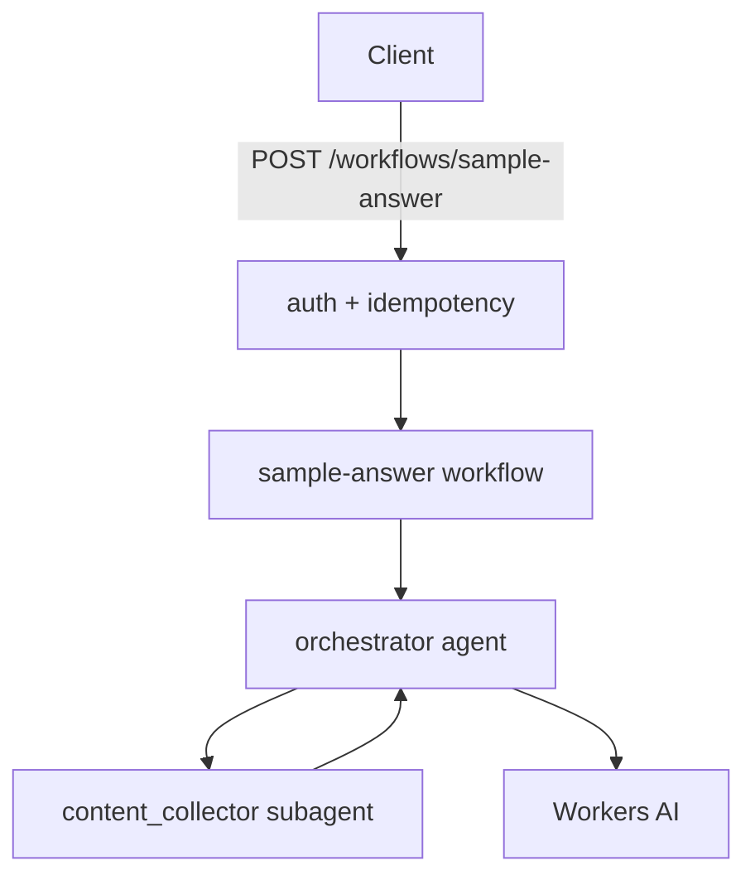

# worker-agent

Flue agent Worker for the monorepo: a small **orchestrator → subagent → workflow** demo on Cloudflare Workers. It accepts a question, delegates research to a `content_collector` subagent, and returns a structured `{ answer, sources[] }` response validated against valibot schemas.

Prompts use placeholder copy — replace them when you implement a real use case. Inference runs on **Workers AI** through the `AI` binding and AI Gateway (no external LLM API key).

**Local dev:** `http://localhost:8788` — see [Getting started](#getting-started).

Agent-oriented details: [AGENTS.md](./AGENTS.md).

## Architecture



| Component | Slug | Model (Workers AI) |
|-----------|------|--------------------|
| Orchestrator | `orchestrator` | Kimi K2.6 |
| Subagent | `content_collector` | Gemma 4 26B |

## Endpoints

All routes except `/` and `/health` require `AGENT_API_KEY` (`X-API-Key` or `Authorization: Bearer`).

| Method / path | Description |
|---------------|-------------|
| `POST /workflows/sample-answer` | Main entry — `{ question }` → `{ answer, sources[] }` |
| `GET /runs/:runId` | Workflow run status |
| `POST /agents/orchestrator/:id` | Drive the agent directly |
| `GET /agents/orchestrator/:id` | Agent event stream |
| `GET /health` | `{ status: "ok" }` |

Add `?wait=result` on workflow or agent POST for a synchronous response. Send `Idempotency-Key` on workflow POST to dedupe retries (24h KV cache).

## Getting started

**Prerequisites:** Node ≥ 22, pnpm 10, Cloudflare account for deploy.

```sh
# From repo root
make install
cp apps/worker-agent/.dev.vars.example apps/worker-agent/.dev.vars
# Set AGENT_API_KEY in .dev.vars (openssl rand -base64 32)

pnpm --filter worker-agent dev     # http://localhost:8788
pnpm --filter worker-agent test    # unit tests
pnpm --filter worker-agent build   # dist/worker_agent/wrangler.json
pnpm --filter worker-agent deploy  # build + deploy generated config
```

## Configuration

Source config: `wrangler.jsonc`. **`flue build`** injects the Worker entrypoint and Durable Object bindings into `dist/worker_agent/wrangler.json` — deploy that generated file.

| Binding / var | Purpose |
|---------------|---------|
| `AI` | Workers AI inference |
| `IDEMPOTENCY_KV` | Idempotency replay cache |
| `AI_GATEWAY_ID` | Gateway id (`default`) |
| `AGENT_API_KEY` | Inbound API key (secret / `.dev.vars`) |

Durable Objects: `v1` → `FlueRegistry` + `FlueOrchestratorAgent`; `v2` → `FlueSampleAnswerWorkflow`.

## Project layout

```
src/
├── agents/          orchestrator + content_collector subagent
├── workflows/       sample-answer
├── dtos/sample/     valibot workflow schemas
├── middlewares/     API key guard, idempotency
├── providers/       Workers AI registration
├── routes/          health + service descriptor
└── mcp/             reserved for a future MCP client
```

See [AGENTS.md](./AGENTS.md) for the full agent guide and [../../AGENTS.md](../../AGENTS.md) for monorepo conventions.
