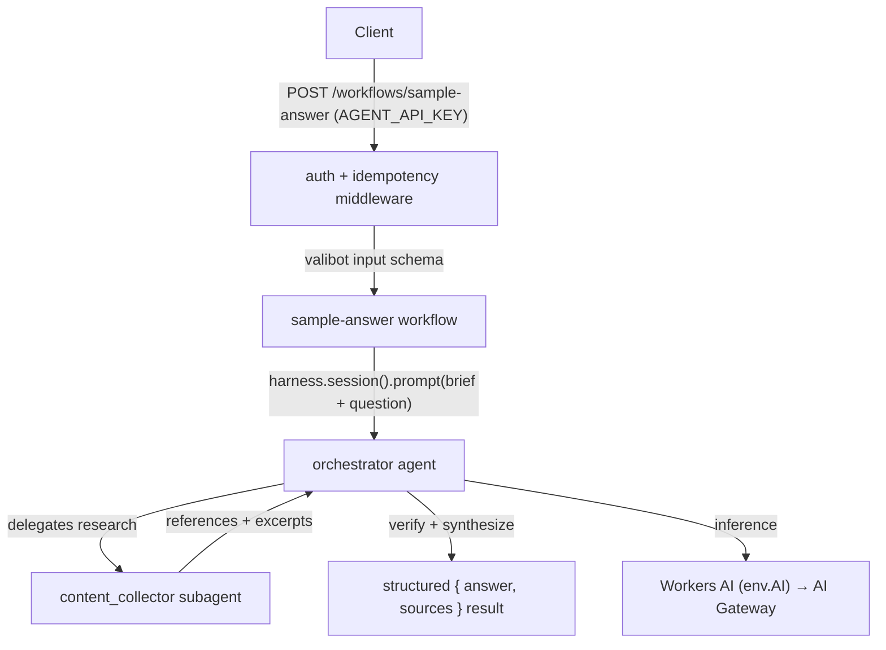

# Agent Worker

[](https://oxc.rs/)
[](https://www.typescriptlang.org/)
[](https://developers.cloudflare.com/workers/)
[](https://www.npmjs.com/package/@flue/runtime)
[](https://developers.cloudflare.com/workers-ai/)
[](https://vitest.dev/)

`worker-agent` is the **Flue agent Worker** of the monorepo. It exposes a **`sample-answer` workflow** (and the underlying `orchestrator` agent) that answers questions by delegating source collection to a `content_collector` subagent. The orchestrator then verifies citations and synthesizes a sourced, schema-validated answer. Inference runs on **Workers AI** routed through an **AI Gateway** — there is no external LLM provider key. Every Flue surface requires the Worker's own **`AGENT_API_KEY`**.

Local dev endpoint: `http://localhost:8788` (`pnpm --filter worker-agent dev`).

## Tech Stack

- **Language:** TypeScript 7 (rc) — strict typechecking via `tsc`
- **Runtime:** Cloudflare Workers (`wrangler`, `nodejs_compat`, smart placement)
- **Agent framework:** Flue (`@flue/runtime`, `@flue/sdk`, `@flue/cli`) + the `agents` SDK — `flue build --target cloudflare` injects the Worker entrypoint and per-agent Durable Object bindings
- **HTTP:** Hono 4 (`@hono/zod-validator` for boundary validation)
- **Inference:** Workers AI (the `AI` binding) routed through AI Gateway (`AI_GATEWAY_ID`, default `default`) — no external provider key
- **Validation:** Zod 4 at the app's own HTTP boundaries (`zValidator` / `safeParse`); valibot for Flue's `input`/`output`/`result` schema slots (the installed Flue types them as valibot `GenericSchema`)
- **State:** Durable Objects (`FlueOrchestratorAgent`, `FlueSampleAnswerWorkflow`) for session/run history; a KV namespace for idempotency
- **Formatting/Linting:** Oxc (`oxfmt`, `oxlint`)
- **Tests:** Vitest (unit) + `vitest-evals` (live-model evals)

## Architecture Overview

### App structure

```
apps/worker-agent/
├── src/
│   ├── app.ts                        # Hono app: providers, security headers, auth guard, idempotency, routes + flue()
│   ├── agents/
│   │   ├── orchestrator.ts           # defineAgent(): Kimi K2.6, subagents:[contentCollector], durability/compaction
│   │   ├── orchestrator.md           # orchestrator system prompt
│   │   └── subagents/
│   │       ├── content-collector.ts  # createContentCollector(): defineAgentProfile() with Gemma model
│   │       └── content-collector.md  # subagent system prompt
│   ├── workflows/
│   │   ├── sample-answer.ts          # defineWorkflow(): runs the orchestrator, validates the structured result; exports route + authed runs
│   │   └── sample-answer.md          # workflow brief prepended to the question
│   ├── mcp/                          # Reserved for future MCP client integration (.gitkeep)
│   ├── skills/
│   │   └── mcp-search/              # Flue skill scaffold (placeholder; not wired until MCP returns)
│   ├── providers/
│   │   └── cloudflare-ai.ts         # registers Workers AI (env.AI) + AI Gateway (env.AI_GATEWAY_ID)
│   ├── routes/                       # index.ts + health.ts (/, /health)
│   ├── middlewares/
│   │   ├── require-api-key.ts       # timing-safe AGENT_API_KEY guard (docs-style MiddlewareHandler; X-API-Key or Bearer)
│   │   ├── mutable-response.ts      # re-wraps Flue's immutable-header DO responses so secureHeaders can write
│   │   └── idempotency.ts           # Idempotency-Key header → IDEMPOTENCY_KV deduplication (caches 2xx, 24h TTL)
│   ├── lib/
│   │   └── timing-safe-equal.ts     # constant-time comparison primitives
│   ├── dtos/                         # sample/ (SampleQuestion/SampleAnswer — valibot, Flue slots)
│   ├── enums/                        # Model (Kimi/GLM/Gemma), ThinkingLevel
│   └── types/secrets-env.d.ts       # augments Cloudflare.Env with AGENT_API_KEY
├── flue.config.ts                   # defineConfig({ target: "cloudflare", output: "dist" })
├── wrangler.jsonc                   # SOURCE config; name: worker-agent; AI + IDEMPOTENCY_KV
├── vitest.config.ts                 # unit tests (tests/**/*.test.ts)
├── vitest.evals.config.ts           # live agent evals (tests/evals/**/*.eval.ts)
└── .dev.vars.example
```

> `flue build` reads `wrangler.jsonc` (the source config), injects the generated Worker entrypoint plus the per-agent Durable Object bindings, and writes the deployable `dist/worker_agent/wrangler.json`. **Deploy that generated file, never the source.**

### Request flow



1. `POST /workflows/sample-answer` passes the `AGENT_API_KEY` guard and the `Idempotency-Key` middleware; Flue validates the body against `SampleQuestionSchema` and admits a durable run (`?wait=result` for a synchronous response).
2. The workflow prompts the **`orchestrator`** agent (Kimi K2.6, `thinkingLevel: MEDIUM`, durability, compaction via Gemma), which delegates source collection to the **`content_collector`** subagent.
3. The subagent (Gemma) returns references + excerpts. It does **not** answer the question directly.
4. The orchestrator verifies citations and synthesizes the final answer; the workflow validates it against `SampleAnswerSchema` (`{ answer, sources[] }`).

## Agents

| Agent / subagent     | Definition                                  | Model                                       | Role                                                                          |
| -------------------- | ------------------------------------------- | ------------------------------------------- | ----------------------------------------------------------------------------- |
| `orchestrator`       | `defineAgent()` (the only Durable Object)   | Kimi K2.6 (`@cf/moonshotai/kimi-k2.6`)      | Plans, delegates research, verifies citations, synthesizes the sourced answer |
| `content_collector`  | `defineAgentProfile()` (creates no DO)      | Gemma (`@cf/google/gemma-4-26b-a4b-it`)     | Collects source material, returns references + excerpts only                    |

- **Orchestrator config:** factory that builds the subagent via `createContentCollector()`, then returns `thinkingLevel: MEDIUM`, `durability: { maxAttempts: 3, timeoutMs: 10min }`, `compaction` via Gemma, `subagents: [contentCollector]`.
- **Subagent config:** `thinkingLevel: MEDIUM`.
- **Models** are enumerated in `src/enums/model.ts` (`Model.KIMI_K2_6`, `Model.GLM_5_2`, `Model.GEMMA_4_26B_A4B_IT`). All resolve to Workers AI model IDs.

## HTTP surface

Application routes are wired in `src/routes/`; Flue mounts its own agent/workflow/run routes via `flue()`. Add production `routes` in `wrangler.jsonc` when you deploy.

**Auth:** every endpoint except `/` and `/health` requires `AGENT_API_KEY`, sent as `X-API-Key: <key>` (preferred) or `Authorization: Bearer <key>`. The comparison is constant-time; a missing secret fails closed with `503`.

| Method / path                          | Source                    | Auth | Description                                                                                  |
| -------------------------------------- | ------------------------- | ---- | -------------------------------------------------------------------------------------------- |
| `POST /workflows/sample-answer`        | `workflows/sample-answer` | ✅   | `{ question }` → `{ answer, sources[] }`; honours `Idempotency-Key`; `?wait=result` for sync |
| `GET /runs/:runId`                     | workflow `runs` export    | ✅   | Detail for a sample-answer run (guarded by the workflow's `runs` middleware)                 |
| `POST /agents/orchestrator/:id`        | Flue auto-route           | ✅   | Drive the agent conversationally (`?wait=result` for a synchronous response)               |
| `GET /agents/orchestrator/:id`         | Flue auto-route           | ✅   | Server-sent events stream for an agent instance                                              |
| `GET /health`                          | `routes/health.ts`        | —    | `{ status: "ok" }`                                                                           |
| `GET /`                                | `routes/health.ts`        | —    | Service descriptor listing every endpoint                                                    |

The Hono app applies `trimTrailingSlash`, `secureHeaders`, `mutableResponse` (re-wraps Flue's Durable-Object passthrough responses, whose headers are immutable and would make `secureHeaders` throw), the `AGENT_API_KEY` guard on `/agents/*` and `/workflows/*`, the idempotency middleware on `POST /workflows/*`, and a `bodyLimit` of **256 KB** (`413` on overflow). There is deliberately **no CORS middleware** — all consumers are machine-to-machine; add a strict allowlisted config only when a browser client exists. Rate limiting / budget caps belong at the edge (Cloudflare WAF) and in AI Gateway.

### `POST /workflows/sample-answer` shapes

Defined in `src/dtos/sample/sample-answer.ts` (valibot — Flue's schema slots require it):

- Input `SampleQuestionSchema`: `question` — string, 1–4000 chars, required.
- Output `SampleAnswerSchema`: `answer` (Markdown, sourced) and `sources[]` (`reference` + optional `excerpt`), validated by the workflow before the run completes.

> Per-run history and its full event stream stay available from Flue's own durable routes — `GET /runs/:runId` and `GET /agents/:name/:id` (SSE / long-poll / catch-up) — backed by Durable Object SQLite.

## Getting Started

### Prerequisites

- Node ≥ 22
- pnpm 10 (run commands from the repo root)
- A Cloudflare account + `wrangler login` to deploy

### Configure environment (local dev)

Copy the example file and fill it in (never commit it):

```sh
cp apps/worker-agent/.dev.vars.example apps/worker-agent/.dev.vars
```

```sh
ENVIRONMENT=dev
AGENT_API_KEY=<inbound key this Worker requires; openssl rand -base64 32>
```

`.dev.vars` overrides the production `vars` from `wrangler.jsonc` during local dev. `AGENT_API_KEY` is the key *this* Worker requires on `/agents/*`, `/workflows/*` and `/runs/:runId`; endpoints answer `503` while it is unset.

### Run locally

From the repo root, `make dev` runs every workspace in parallel (`flue dev` serves this Worker on `:8788`). To run just this Worker:

```sh
pnpm --filter worker-agent dev    # flue dev --target cloudflare
```

### Build & deploy

```sh
pnpm --filter worker-agent build     # flue build --target cloudflare → dist/worker_agent/wrangler.json
pnpm --filter worker-agent deploy    # build, then wrangler deploy --config dist/worker_agent/wrangler.json
```

### Test

```sh
pnpm --filter worker-agent test      # vitest — unit tests (schemas, enums, auth guard, idempotency, routes)
pnpm --filter worker-agent evals     # vitest-evals — live-model agent evals (needs a running Flue app)
```

Unit tests live in `tests/**/*.test.ts` (deterministic, no network). Evals live in `tests/evals/**/*.eval.ts` and exercise real agent runs (60 s per-test timeout); export `AGENT_API_KEY=<key>` so the harness can authenticate against the target.

## Configuration

Bindings and vars live in `apps/worker-agent/wrangler.jsonc` (the source config). `flue build` injects the agent entrypoint and Durable Object bindings into the deployable `dist/worker_agent/wrangler.json`. Regenerate the binding types with `pnpm --filter worker-agent types`.

| Variable             | Kind          | Purpose                                                          |
| -------------------- | ------------- | ---------------------------------------------------------------- |
| `AI`                 | AI            | Workers AI binding (`remote: true`); all inference routes through it |
| `IDEMPOTENCY_KV`     | KV            | Dedup cache for the `Idempotency-Key` middleware, 24h TTL        |
| `ENVIRONMENT`        | var           | `production` (set `dev` locally)                                 |
| `AI_GATEWAY_ID`      | var           | AI Gateway id (`default` uses the implicit gateway); no provider key — auth follows the Worker's account |
| `AGENT_API_KEY`      | secret        | Inbound key required on `/agents/*`, `/workflows/*`, `/runs/:runId` |

Durable Objects: migration `v1` declares `FlueRegistry` and `FlueOrchestratorAgent`; `v2` appends `FlueSampleAnswerWorkflow`. Subagents create no Durable Object.

### Idempotency

`POST /workflows/*` is wrapped by the `idempotency` middleware (`src/middlewares/idempotency.ts`). When a request carries an `Idempotency-Key` header, the first successful (`2xx`) response is snapshotted to `IDEMPOTENCY_KV` (status, body, content-type) under the `idem:<path>:` prefix with a **24h TTL**; a repeat of the same key replays the cached response with an `Idempotent-Replayed: true` header. The body is not fingerprinted — clients must reuse the same key.

## Conventions

- **Filenames** are kebab-case (enforced by `unicorn/filename-case`).
- **Zod schemas** are named `…Schema` (e.g. `…RequestSchema` / `…ResponseSchema`); their inferred types drop the `Schema` suffix. The `Type` suffix is forbidden.
- **Flue schema slots** (`defineWorkflow` `input`/`output`, `session.prompt` `result`) use **valibot** — the installed Flue types them as valibot `GenericSchema`, so Zod does not fit there. Everything else stays on Zod 4.
- **Enum values reused across workspaces** come from `@repo/enums-common` (e.g. `HttpMethod`, `HttpHeader`) — never redefine them locally. Worker-local enums live in `src/enums/`.
- **Boundary validation** uses `zValidator(...)` / `safeParse` on every inbound request.
- **Functions** stay ≤ 100 lines (Oxc `max-lines-per-function`).

See the repo-root [`README.md`](../../README.md) and [`AGENTS.md`](../../AGENTS.md) for the full monorepo architecture, the decision checklist, and the "where to put things" map.
